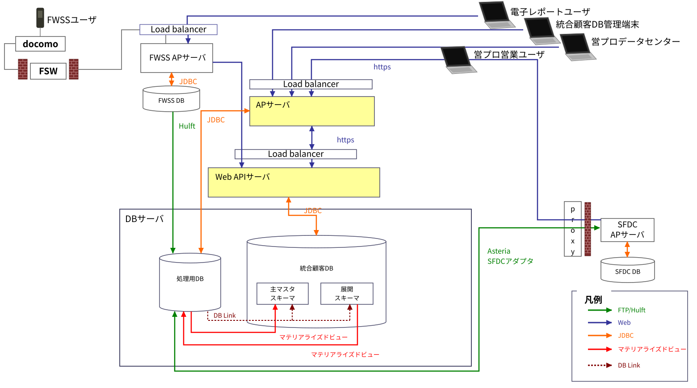
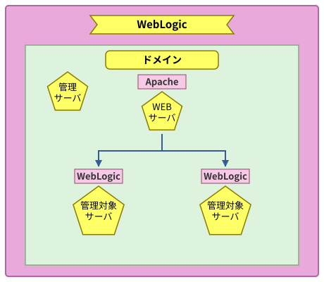

# 統合顧客DB システム WebLogic 設計書

| 項目 | 内容 |
|---|---|
| 文書名 | 統合顧客DB システム WebLogic 設計書 |
| 原本バージョン | 1.0.1（初版作成日 2011/02/21、最終更新日 2011/06/29）※1 |
| 原本作成者 | 富士ゼロックス情報システム株式会社 システム企画・技術統括部 システム基盤技術部 |
| 本書の版 | ver2（復元清書版） |
| 本書の作成日 | 2026-09-14 |
| 本書の位置づけ | 処理用DB老朽化対応（WebLogic 10.3.4 → Apache + Tomcat 9 移行）における**現行 WebLogic 設計の基準文書**。原本（2011 年版）を復元した ver1（Word）を Markdown 化し、章・表番号の整理、転記ゆれの修正、図の再作成を行ったもの。**設計内容（設定値・命名・方針）は原本のまま変更していない** |

※1 原本の表紙は「バージョン 1.0.0 / 最終更新日 2011/06/07」、変更履歴（6 章）の最終行は「1.0.1 / 2011/06/29」であり、原本内で表記が一致していない。本書では変更履歴の値を採用した（付録 A 参照）。

## 復元版の改訂履歴

| 版 | 日付 | 内容 |
|---|---|---|
| ver1 | 2026-09-14 | 原本（2011 年版）の動画から Word 文書として復元。図は画面キャプチャを仮置き |
| ver2 | 2026-09-14 | Markdown 化（清書）。見出し階層と章番号・表番号の重複を整理、転記ゆれ・誤記を修正、図 1-1／図 5-1 を SVG で再作成、原本内の不整合を【要確認】として付録 A に整理 |

> 本書中の **【要確認】** は、原本（ver1）の記載どおりに転記したうえで、原本内で整合が取れていない、または移行設計の前提として実機確認が必要と判断した箇所である。確認結果は付録 A の一覧に反映すること。

## 目次

- [復元版の改訂履歴](#復元版の改訂履歴)
- [1. はじめに](#1-はじめに)
  - [1.1. 本文書の目的](#11-本文書の目的)
  - [1.2. 本文書の適用範囲](#12-本文書の適用範囲)
  - [1.3. 関連文書](#13-関連文書)
    - [1.3.1. 参照文書](#131-参照文書)
  - [1.4. 用語](#14-用語)
- [2. システム概要](#2-システム概要)
  - [2.1. ハードウェア](#21-ハードウェア)
  - [2.2. オペレーティングシステム](#22-オペレーティングシステム)
  - [2.3. ソフトウェア](#23-ソフトウェア)
- [3. サーバ設計](#3-サーバ設計)
  - [3.1. ノード構成](#31-ノード構成)
  - [3.2. OS ユーザ](#32-os-ユーザ)
    - [3.2.1. アカウント及びグループ一覧](#321-アカウント及びグループ一覧)
    - [3.2.2. 環境変数](#322-環境変数)
  - [3.3. ディレクトリ構成](#33-ディレクトリ構成)
    - [3.3.1. ミドルウェア関連](#331-ミドルウェア関連)
    - [3.3.2. ログ関連](#332-ログ関連)
    - [3.3.3. コンフィギュレーション関連](#333-コンフィギュレーション関連)
    - [3.3.4. 起動 ID 関連](#334-起動-id-関連)
  - [3.4. ネットワーク](#34-ネットワーク)
    - [3.4.1. IP アドレス](#341-ip-アドレス)
    - [3.4.2. 利用プロトコル及びポート一覧](#342-利用プロトコル及びポート一覧)
- [4. WebLogic 命名規約](#4-weblogic-命名規約)
  - [4.1. WebLogic マシン名](#41-weblogic-マシン名)
  - [4.2. WebLogic ドメイン名](#42-weblogic-ドメイン名)
  - [4.3. WebLogic 管理サーバ名](#43-weblogic-管理サーバ名)
  - [4.4. WebLogic 管理対象サーバ名](#44-weblogic-管理対象サーバ名)
  - [4.5. ログファイル名](#45-ログファイル名)
    - [4.5.1. Apache アクセスログ名](#451-apache-アクセスログ名)
    - [4.5.2. Apache エラーログ名](#452-apache-エラーログ名)
    - [4.5.3. Apache-WebLogic コネクタログ名](#453-apache-weblogic-コネクタログ名)
    - [4.5.4. WebLogic ドメインログ名](#454-weblogic-ドメインログ名)
    - [4.5.5. WebLogic 管理サーバアクセスログ名](#455-weblogic-管理サーバアクセスログ名)
    - [4.5.6. WebLogic 管理サーバサーバログ名](#456-weblogic-管理サーバサーバログ名)
    - [4.5.7. WebLogic 管理サーバコンソールログ名](#457-weblogic-管理サーバコンソールログ名)
    - [4.5.8. WebLogic 管理対象サーバアクセスログ名](#458-weblogic-管理対象サーバアクセスログ名)
    - [4.5.9. WebLogic 管理対象サーバサーバログ名](#459-weblogic-管理対象サーバサーバログ名)
    - [4.5.10. WebLogic 管理対象サーバコンソールログ名](#4510-weblogic-管理対象サーバコンソールログ名)
- [5. WebLogic 設計](#5-weblogic-設計)
  - [5.1. コンフィギュレーション設計](#51-コンフィギュレーション設計)
    - [5.1.1. WebLogic インストール・コンフィギュレーション](#511-weblogic-インストールコンフィギュレーション)
    - [5.1.2. Apache インストール・コンフィギュレーション](#512-apache-インストールコンフィギュレーション)
    - [5.1.3. Apache-WebLogic コネクタ インストール・コンフィギュレーション](#513-apache-weblogic-コネクタ-インストールコンフィギュレーション)
  - [5.2. システム設計](#52-システム設計)
    - [5.2.1. ドメイン構成](#521-ドメイン構成)
    - [5.2.2. 管理サーバ、管理対象サーバ構成](#522-管理サーバ管理対象サーバ構成)
    - [5.2.3. データベース接続構成](#523-データベース接続構成)
  - [5.3. WebLogic ユーザ設計](#53-weblogic-ユーザ設計)
    - [5.3.1. 管理ユーザ設計](#531-管理ユーザ設計)
  - [5.4. WebLogic 運用設計](#54-weblogic-運用設計)
    - [5.4.1. 性能情報収集について](#541-性能情報収集について)
    - [5.4.2. リカバリ／バックアップ設計](#542-リカバリバックアップ設計)
    - [5.4.3. ログファイル管理](#543-ログファイル管理)
    - [5.4.4. アクセスログチューニング](#544-アクセスログチューニング)
    - [5.4.5. 稼動プロセス](#545-稼動プロセス)
    - [5.4.6. 接続先 URL](#546-接続先-url)
  - [5.5. 未完了の課題](#55-未完了の課題)
  - [5.6. 完了済みの課題](#56-完了済みの課題)
- [6. 変更履歴](#6-変更履歴)
- [付録 A. ver2（清書版）での修正・注記一覧](#付録-a-ver2清書版での修正注記一覧)
  - [A.1. 章番号・表番号の対応（原本 → ver2）](#a1-章番号表番号の対応原本--ver2)
  - [A.2. 転記ゆれ・誤記の修正一覧（設計内容の変更なし）](#a2-転記ゆれ誤記の修正一覧設計内容の変更なし)
  - [A.3. 原本内の不整合・要確認事項一覧（設計内容に関わるため未修正）](#a3-原本内の不整合要確認事項一覧設計内容に関わるため未修正)
  - [A.4. 図の作成情報](#a4-図の作成情報)

---

## 1. はじめに

### 1.1. 本文書の目的

本文書は統合顧客DB システムの WebLogic 設計に関する構成を規定することを目的とし、以下の項目について記載する。

1. 統合顧客DB サーバ WebLogic 製品に関する設計
2. 本システムの WebLogic を運用するための方針、留意点

本文書の一部は、下記タスクへのインプット情報となる。

- 運用設計への基本情報

### 1.2. 本文書の適用範囲

本文書の適用範囲を以下に示す。

下図（図 1-1 システム構成）の黄色で示した部分（AP サーバ、Web API サーバ）を適用範囲とする。

図 1-1 システム構成

### 1.3. 関連文書

#### 1.3.1. 参照文書

表 1-1 参照文書

| NO | 文書名 | 版 | 最終更新日 | 作成者 |
|---|---|---|---|---|
| 1 | TA 戦略 | 0.9 | 2011/04/11 | FXIS |
| 2 | 統合顧客DB システム 基盤設計書.doc | 1.0 | 2011/XX/XX | FXIS |
| 3 | WebLogic デザインシート_本番環境.xls | 1.0 | 2011/XX/XX | FXIS |
| 4 | WebLogic デザインシート_QA 環境.xls | 1.0 | 2011/XX/XX | FXIS |
| 5 | 環境定義書 | 1.0 | 2011/XX/XX | FXIS |
| 6 | ユーザ・パスワード管理表 | 1.0 | 2011/XX/XX | FXIS |
| 7 | IP アドレス一覧管理表 | 1.0 | 2011/XX/XX | FXIS |

※ 本文中の「参照文書【WebLogic デザインシート_本番環境】」「参照文書【WebLogic デザインシート_QA 環境】」は、それぞれ上表 No.3、No.4 を指す。設定値の実体はデザインシート側に記載されており、本書には収録されていない【要確認】（付録 A 参照）。

### 1.4. 用語

表 1-2 用語

| 用語 | 読み | 意味 |
|---|---|---|
| FX | ｴﾌｴｯｸｽ | 富士ゼロックス株式会社の略称 |
| FXIS | ｴﾌｴｯｸｽｱｲｴｽ | 富士ゼロックス情報システム株式会社の略称 |
| 統合顧客DB システム | ﾄｳｺﾞｳｺｷｬｸﾃﾞｨｰﾋﾞｰｼｽﾃﾑ | 様々な業務プロセス上で蓄積されたお客様情報を統合化し、情報の精度、鮮度を適切に維持管理するとともに、幅広いユーザ層に自由度の高いデータ活用を提供するシステム |
| 営プロ | ｼﾝｴｲｷﾞｮｳｼｴﾝｼｽﾃﾑ | インターネットを介して必要なマスタデータ・トランザクションデータを SFDC 側のデータセンターに配置し、これらを利用した業務機能の提供をインターネットを介して行うシステム |
| 電子レポート | ﾃﾞﾝｼﾚﾎﾟｰﾄ | FWSS および統合顧客DB を介して営業／CE 相互の情報連携を行い、オンサイト保守業務を支援する |
| FWSS | ｴﾌﾀﾞﾌﾞﾙｴｽｴｽ | Field Work Support System の略。富士ゼロックスの基幹システム |
| SFDC | ｴｽｴﾌﾃﾞｨｰｼｰ | Salesforce.com の略。CRM ソリューションを中心としたクラウドコンピューティング・サービスの提供企業。顧客情報を独自 DB で管理し、Internet 経由でお客様 DB へ配信する |
| WebLogic Server 11g リリース 1 Enterprise Edition (10.3.4) | ｳｪﾌﾞﾛｼﾞｯｸｻｰﾊﾞｲﾚﾌﾞﾝｼﾞｰﾘﾘｰｽﾜﾝｴﾝﾀｰﾌﾟﾗｲｽﾞｴﾃﾞｨｼｮﾝｼﾞｭｯﾃﾝｻﾝﾃﾝﾖﾝ | 分散 Java アプリケーションの開発、運用、管理を目的として開発された高い拡張性をもつアプリケーション・サーバ |
| Apache HTTP Server 2.2.3 | ｱﾊﾟｯﾁｴｲﾁﾃｨｰﾃｨｰｻｰﾊﾞﾆｲﾃﾝﾆｲﾃﾝｻﾝ | Apache とは、Apache Software Foundation が開発している HTTP サーバーソフトウェアの名称である。オープンソースソフトウェアとして開発され、配布されている |
| jrockit-jdk1.6.0_20-R28 | ｼﾞｪｲﾛｷｯﾄｼﾞｪｲﾃﾞｨｰｹｰｲｯﾃﾝﾛｸﾃﾝｾﾞﾛｱﾝﾀﾞｰﾊﾞｰﾆｼﾞｭｳﾊｲﾌﾝｱｰﾙﾆｼﾞｭｳﾊﾁ | Oracle 社の Java Virtual Machine。クラスライブラリは Sun の JVM と互換 |
| AP | ｴｰﾋﾟｰ | Application の略 |
| API | ｴｰﾋﾟｰｱｲ | Application Interface の略 |
| DB | ﾃﾞｰﾋﾞｰ | Database の略 |

---

## 2. システム概要

本章では統合顧客DB システムにおける WebLogic に関連するシステム概要について記載する。

### 2.1. ハードウェア

参照文書【統合顧客DB システム 基盤設計書】の同項を参照とする。

### 2.2. オペレーティングシステム

参照文書【統合顧客DB システム 基盤設計書】の同項を参照とする。

### 2.3. ソフトウェア

全体に関わるソフトウェアのアーキテクチャに関しては、参照文書【統合顧客DB システム 基盤設計書】の 9 章「物理設計」のソフトウェア構成図を参照とする。

本項では、WebLogic 設計に関わるソフトウェア情報のみを記載する。

表 2-1 ソフトウェア情報

| サーバ | 種別 | 名称 | バージョン番号 | 備考 |
|---|---|---|---|---|
| AP サーバ、API サーバ | WebLogic | WebLogic Server 11g リリース 1 Enterprise Edition | 10.3.4 | |
| AP サーバ、API サーバ | Apache | Apache HTTP Server 2.2.3 | 2.2.3 | |
| AP サーバ、API サーバ | Java Virtual Machine | jrockit-jdk1.6.0_20-R28.1.0-4.0.1-linux-x64 | 1.6.0_20-R28 | |
| AP サーバ、API サーバ | WebLogic | mod_wl_22.so | | WebLogic プラグインインストール（WebLogic Server Plugins） |

---

## 3. サーバ設計

本章では統合顧客DB システムにおける WebLogic に関するサーバの設計を行う。

### 3.1. ノード構成

WebLogic サーバのノード構成は、one-Node 構成となっている。

### 3.2. OS ユーザ

AP サーバ、API サーバ上で WebLogic を管理／所有／利用する OS ユーザを記載する。

#### 3.2.1. アカウント及びグループ一覧

AP サーバ、API サーバ上で WebLogic に関するアカウント及びグループについて記載する。

本システムでは、WebLogic で使用するアカウントを weblogic とし、プライマリ・グループに Oracle インベントリ・グループ（oinstall）、セカンダリ・グループに WebLogic 管理者用グループ（webadmin）を指定した構成とする。また、本システムに存在する全ドメインにて weblogic ユーザを共有する設計とする。

尚、weblogic ユーザ・グループに関する設定内容は、参照文書【ユーザ・パスワード管理表】を参照とする。

| ユーザ | プライマリ・グループ | セカンダリ・グループ | 用途 |
|---|---|---|---|
| weblogic | oinstall | webadmin | WebLogic の管理／所有／利用（全ドメイン共通） |

#### 3.2.2. 環境変数

weblogic ユーザに関連する環境変数を記載する。

環境変数については、以下を参照とする。

- 参照文書【WebLogic デザインシート_QA 環境】の「7. 環境変数」
- 参照文書【WebLogic デザインシート_本番環境】の「7. 環境変数」

### 3.3. ディレクトリ構成

AP、API サーバ上で WebLogic に関連するディレクトリ構成を記載する。

#### 3.3.1. ミドルウェア関連

ミドルウェアディレクトリ配置に伴う設計として、インストールディレクトリに関してはシステムディレクトリ配下を使用し、ドメインディレクトリに関してはログ運用等を考慮し、disk1 配下に配置することとする。

表 3-1 ミドルウェア関連ディレクトリ（AP サーバ：本番、QA）

| ディレクトリ | サブディレクトリ | 所有者 | グループ | 権限 | 備考 |
|---|---|---|---|---|---|
| /usr/sbin | | root | root | 755 | Apache 起動シェル格納（apachectl）ディレクトリ |
| /etc/httpd | | root | root | 755 | Apache ホームディレクトリ |
| /opt/oracle/middleware | | weblogic | oinstall | 755 | Oracle ミドルウェアホームディレクトリ |
| | wlserver_10.3 | weblogic | oinstall | 755 | WebLogic インストールディレクトリ |
| | jrockit-jdk1.6.0 | weblogic | oinstall | 755 | JVM インストールディレクトリ |
| /disk1/weblogic/projects/domains | | weblogic | oinstall | 755 | WebLogic ドメイン配置ディレクトリ |

表 3-2 ミドルウェア関連ディレクトリ（API サーバ：本番、QA）

| ディレクトリ | サブディレクトリ | 所有者 | グループ | 権限 | 備考 |
|---|---|---|---|---|---|
| /usr/sbin | | root | root | 755 | Apache 起動シェル格納（apachectl）ディレクトリ |
| /etc/httpd | | root | root | 755 | Apache ホームディレクトリ |
| /opt/oracle/middleware ※ | | weblogic | oinstall | 755 | Oracle ミドルウェアホームディレクトリ |
| | wlserver_10.3 | weblogic | oinstall | 755 | WebLogic インストールディレクトリ |
| | jrockit-jdk1.6.0 | weblogic | oinstall | 755 | JVM インストールディレクトリ |
| /disk1/weblogic/projects/domains | | weblogic | oinstall | 755 | WebLogic ドメイン配置ディレクトリ |

※ 原本（ver1）では API サーバのミドルウェアホームが「/opt/oracle/Middleware」（M が大文字）と表記されていた。AP サーバの表および 5.4.5 稼動プロセスのパス表記（/opt/oracle/middleware）に合わせて小文字に統一した。実機の実パスは要確認【要確認】。

#### 3.3.2. ログ関連

ログディレクトリ配置に伴う設計として、解析時の利便性を考慮し、ミドルウェアのレイヤー階層に近しい構造としている。

表 3-3 ログ関連ディレクトリ（AP、API サーバ：本番、QA）

| ディレクトリ | 所有者 | グループ | 権限 | 備考 |
|---|---|---|---|---|
| /disk1/httpd/logs/ | root | root | 700 | Apache アクセスログ、エラーログ格納ディレクトリ |
| /disk1/weblogic/logs/ | weblogic | oinstall | 777 | Apache-WebLogic コネクタログ格納ディレクトリ |
| /disk1/weblogic/projects/domains/*＜ドメイン名＞*/servers/*＜サーバ名＞*/logs | weblogic | oinstall | 740 | WebLogic アクセスログ、WebLogic コンソールログ、WebLogic サーバログ、WebLogic ドメインログ ※WebLogic ドメインログは管理サーバのみ |

※＜ドメイン名＞は、対象のドメイン別（5.2.1 ドメイン構成参照）に読み替えとする。

※＜サーバ名＞は、対象の管理サーバ、管理対象サーバ別（5.2.2 管理サーバ、管理対象サーバ構成参照）に読み替えとする。

#### 3.3.3. コンフィギュレーション関連

表 3-4 コンフィギュレーション関連ディレクトリ（AP、API サーバ：本番、QA）

| ディレクトリ | 所有者 | グループ | 権限 | 備考 |
|---|---|---|---|---|
| /etc/httpd/conf | root | root | 744 | Apache コンフィギュレーションファイル格納ディレクトリ |
| /etc/httpd/conf.d | root | root | 744 | Apache 外部コンフィギュレーションファイル格納ディレクトリ |
| /projects/domains/*＜ドメイン名＞*/config ※ | weblogic | oinstall | 750 | WebLogic コンフィギュレーションファイル格納ディレクトリ |

※ 原本（ver1）の表記のまま。表 3-1／表 3-2 のドメイン配置ディレクトリから、実体は「/disk1/weblogic/projects/domains/＜ドメイン名＞/config」と考えられる【要確認】。

※＜ドメイン名＞は、対象のドメイン別（5.2.1 ドメイン構成参照）に読み替えとする。

#### 3.3.4. 起動 ID 関連

表 3-5 起動 ID 関連ディレクトリ（AP、API サーバ：本番、QA）

| ディレクトリ | 所有者 | グループ | 権限 | 備考 |
|---|---|---|---|---|
| /disk1/weblogic/projects/domains/*＜ドメイン名＞*/servers/*＜サーバ名＞*/security | weblogic | oinstall | 755 | WebLogic 起動 ID ファイル格納ディレクトリ |

※＜ドメイン名＞は、対象のドメイン別（5.2.1 ドメイン構成参照）に読み替えとする。

※＜サーバ名＞は、対象の管理サーバ、管理対象サーバ別（5.2.2 管理サーバ、管理対象サーバ構成参照）に読み替えとする。

### 3.4. ネットワーク

サーバのネットワーク設定として IP アドレス、プロトコル、ポートについて記載する。

#### 3.4.1. IP アドレス

参照文書【統合顧客DB システム 基盤設計書】より、指定資料を参照とする。

#### 3.4.2. 利用プロトコル及びポート一覧

統合顧客DB サーバ上で WebLogic に使用されるプロトコル及びポート番号を記載する。

本番環境に関しては、サーバ別にポートを識別し、誤アクセスを防ぐ設計としている。

QA 環境に関しては、ドメインが 4 つ存在する事による広範囲のポート使用を極力抑える為、サーバ別ポートを同一としている。

尚、WebLogic で使用するポートは、自由に使用可能なポート番号（49152 番 - 65535 番）から 60100～60212 番を使用するものとする。

- プロトコル

参照文書【統合顧客DB システム 基盤設計書】より、通信プロトコル一覧を参照とする。

- ポート

表 3-6 ポート一覧（AP サーバ：本番）

| ソフトウェア | ポート名（種類） | ポート番号 | 備考 |
|---|---|---|---|
| Apache HTTP Server 2.2.3 | TCP/IP Port | 80 | HTTP リスンポート |
| WebLogic Server 11g リリース 1 Enterprise Edition (10.3.4) | TCP/IP Port | 60100 | 管理サーバ用ポート |
| | TCP/IP Port | 60111 | 管理対象サーバ 1 号機用ポート |
| | TCP/IP Port | 60112 | 管理対象サーバ 2 号機用ポート |

表 3-7 ポート一覧（API サーバ：本番）

| ソフトウェア | ポート名（種類） | ポート番号 | 備考 |
|---|---|---|---|
| Apache HTTP Server 2.2.3 | TCP/IP Port | 80 | HTTP リスンポート |
| WebLogic Server 11g リリース 1 Enterprise Edition (10.3.4) | TCP/IP Port | 60200 | 管理サーバ用ポート |
| | TCP/IP Port | 60211 | 管理対象サーバ 1 号機用ポート |
| | TCP/IP Port | 60212 | 管理対象サーバ 2 号機用ポート |

表 3-8 ポート一覧（AP サーバ：QA）

| ソフトウェア | ポート名（種類） | ポート番号 | 備考 |
|---|---|---|---|
| Apache HTTP Server 2.2.3 | TCP/IP Port | 80 | HTTP リスンポート |
| WebLogic Server 11g リリース 1 Enterprise Edition (10.3.4) | TCP/IP Port | 60100 | 管理サーバ用ポート |
| | TCP/IP Port | 60111 | 管理対象サーバ 1 号機用ポート |
| | TCP/IP Port | 60112 | 管理対象サーバ 2 号機用ポート |

表 3-9 ポート一覧（API サーバ：QA）

| ソフトウェア | ポート名（種類） | ポート番号 | 備考 |
|---|---|---|---|
| Apache HTTP Server 2.2.3 | TCP/IP Port | 80 | HTTP リスンポート |
| WebLogic Server 11g リリース 1 Enterprise Edition (10.3.4) | TCP/IP Port | 60100 | 管理サーバ用ポート |
| | TCP/IP Port | 60111 | 管理対象サーバ 1 号機用ポート |
| | TCP/IP Port | 60112 | 管理対象サーバ 2 号機用ポート |

---

## 4. WebLogic 命名規約

本章では統合顧客DB システムにおける WebLogic 命名規約について記載する。

表 4-1 共通区分

| No | 名称 | 説明 | 備考 |
|---|---|---|---|
| 1 | 環境区分 | 本番用：なし QA 用：qa | 環境を表す |
| 2 | サーバ区分 | AP サーバ：ap API サーバ：api | サーバ別用途を表す |
| 3 | 連番 | 01～02 | サーバ連番を表す |

※ 以降のフォーマット中の *斜体* は可変部分を表す。

### 4.1. WebLogic マシン名

本項では、統合顧客DB システムの WebLogic マシン名の命名規則について記述する。

- 命名方針

統合顧客DB サーバ内（AP、API サーバ）の WebLogic マシン名を一意にする。

マシン名については、拡張性を考慮し、クラスタリングされた場合でも命名規約が保てるように、サーバ名の先頭文字列（シーケンス部分を除外した）を引用している。

- フォーマット

*＜マシン名＞*

表 4-2 マシン名

| No | 名称 | 説明 | 備考 |
|---|---|---|---|
| 1 | マシン名 | 本番 AP：icaph 本番 API：icwah QA AP：icapq QA API：icwaq | |

### 4.2. WebLogic ドメイン名

本項では、統合顧客DB システムの WebLogic ドメイン名の命名規則について記述する。

- 命名方針

統合顧客DB サーバ内（AP、API サーバ）の WebLogic ドメイン名を一意にする。

ドメインは、WebLogic Server インスタンスの基本的な管理単位であり、サーバとしての管理単位は AP、API であるため。

※ドメインについては、接続詞にアンダーバーを使用する。

- フォーマット

*＜サーバ区分＞* + "_" + *＜環境区分＞* + "_domain"

※環境区分が「なし」の場合、"_" は付与しない。

- 適用例

| 環境 | サーバ | ドメイン名 |
|---|---|---|
| 本番 | AP | ap_domain |
| 本番 | API | api_domain |
| QA | AP | ap_qa_domain |
| QA | API | api_qa_domain |

### 4.3. WebLogic 管理サーバ名

本項では、統合顧客DB システムの WebLogic 管理サーバ名の命名規則について記述する。

- 命名方針

統合顧客DB サーバ内（AP、API サーバ）の WebLogic 管理サーバ名を一意にする。

※サーバ名については、接続詞にハイフンを使用する。

- フォーマット

*＜マシン名＞* + "-" + *＜環境区分＞* + "-kanri"

※環境区分が「なし」の場合、"-" は付与しない。

- 適用例

| 環境 | サーバ | 管理サーバ名 |
|---|---|---|
| 本番 | AP | icaph-kanri |
| 本番 | API | icwah-kanri |
| QA | AP | icapq-qa-kanri |
| QA | API | icwaq-qa-kanri |

### 4.4. WebLogic 管理対象サーバ名

本項では、統合顧客DB システムの WebLogic 管理対象サーバ名の命名規則について記述する。

- 命名方針

統合顧客DB サーバ内（AP、API サーバ）の WebLogic 管理対象サーバ名を一意にする。

※サーバ名については、接続詞にハイフンを使用する。

- フォーマット

*＜マシン名＞* + "-" + *＜環境区分＞* + "-" + *＜サーバ区分＞* + *＜連番＞*

※環境区分が「なし」の場合、*＜環境区分＞* 前後の "-" は 1 つとする（"-" を重ねて付与しない）。

- 適用例

| 環境 | サーバ | 管理対象サーバ名 |
|---|---|---|
| 本番 | AP | icaph-ap01、icaph-ap02 |
| 本番 | API | icwah-api01、icwah-api02 |
| QA | AP | icapq-qa-ap01、icapq-qa-ap02 ※ |
| QA | API | icwaq-qa-api01、icwaq-qa-api02 ※ |

※ フォーマットどおりの名称。5.2.2 の表 5-4（QA 環境）では QA 環境の管理対象サーバ名が「icapq-ap01」「icwaq-api01」（環境区分なし）と記載されており、5.4.3 のログファイル名（icapq-qa-ap01.log 等）とも一致しない。実機の config.xml で確定すること【要確認】。

### 4.5. ログファイル名

本項では、統合顧客DB システムのログファイル名の命名規則について記述する。

#### 4.5.1. Apache アクセスログ名

本項では、統合顧客DB システムの Apache アクセスログの命名規則について記述する。

- 命名方針

統合顧客DB サーバ内（AP、API サーバ）の Apache アクセスログ名を一意にする。

- フォーマット

"access_log" + "_for_" + *＜環境区分＞*

※環境区分が「なし」の場合、"_for_" は付与しない。（本番：access_log、QA：access_log_for_qa）

#### 4.5.2. Apache エラーログ名

本項では、統合顧客DB システムの Apache エラーログの命名規則について記述する。

- 命名方針

統合顧客DB サーバ内（AP、API サーバ）の Apache エラーログ名を一意にする。

- フォーマット

"error_log" + "_for_" + *＜環境区分＞*

※環境区分が「なし」の場合、"_for_" は付与しない。（本番：error_log、QA：error_log_for_qa）

#### 4.5.3. Apache-WebLogic コネクタログ名

本項では、統合顧客DB システムの Apache-WebLogic コネクタログの命名規則について記述する。

- 命名方針

統合顧客DB サーバ内（AP、API サーバ）の Apache-WebLogic コネクタログ名を一意にする。

- フォーマット

"wl_proxy_log" + "_for_" + *＜環境区分＞*

※環境区分が「なし」の場合、"_for_" は付与しない。（本番：wl_proxy_log、QA：wl_proxy_log_for_qa）

#### 4.5.4. WebLogic ドメインログ名

本項では、統合顧客DB システムの WebLogic ドメインログの命名規則について記述する。

- 命名方針

統合顧客DB サーバ内（AP、API サーバ）の WebLogic 管理サーバドメインログ名を一意にする。

- フォーマット

*＜サーバ区分＞* + "_" + *＜環境区分＞* + "_domain.log"

※環境区分が「なし」の場合、*＜環境区分＞* 前の "_" は付与しない。（本番：ap_domain.log、QA：ap_qa_domain.log）

#### 4.5.5. WebLogic 管理サーバアクセスログ名

本項では、統合顧客DB システムの WebLogic 管理サーバアクセスログの命名規則について記述する。

- 命名方針

統合顧客DB サーバ内（AP、API サーバ）の WebLogic 管理サーバアクセスログ名を一意にする。

- フォーマット

"access_" + *＜サーバ区分＞* + "-" + *＜環境区分＞* + "-kanri.log"

※環境区分が「なし」の場合、*＜環境区分＞* 前の "-" は付与しない。（本番：access_ap-kanri.log、QA：access_ap-qa-kanri.log ※）

※ 5.4.3 の表 5-10（QA 環境）では「access_ap-kanri.log」（環境区分なし）と記載されており、フォーマットと一致しない。実機のログファイル名で確定すること【要確認】。

#### 4.5.6. WebLogic 管理サーバサーバログ名

本項では、統合顧客DB システムの WebLogic 管理サーバサーバログの命名規則について記述する。

- 命名方針

統合顧客DB サーバ内（AP、API サーバ）の WebLogic 管理サーバサーバログ名を一意にする。

- フォーマット

*＜マシン名＞* + "-" + *＜環境区分＞* + "-kanri.log"

※環境区分が「なし」の場合、"-" は付与しない。（本番：icaph-kanri.log、QA：icapq-qa-kanri.log）

#### 4.5.7. WebLogic 管理サーバコンソールログ名

本項では、統合顧客DB システムの WebLogic 管理サーバコンソールログの命名規則について記述する。

- 命名方針

統合顧客DB サーバ内（AP、API サーバ）の WebLogic 管理サーバコンソールログ名を一意にする。

- フォーマット

*＜マシン名＞* + "-" + *＜環境区分＞* + "-kanri.out"

※環境区分が「なし」の場合、"-" は付与しない。

※フォーマットは、4.5.6 と同等（拡張子のみ .out）。

#### 4.5.8. WebLogic 管理対象サーバアクセスログ名

本項では、統合顧客DB システムの WebLogic 管理対象サーバアクセスログの命名規則について記述する。

- 命名方針

統合顧客DB サーバ内（AP、API サーバ）の WebLogic 管理対象サーバアクセスログ名を一意にする。

- フォーマット

"access_" + *＜環境区分＞* + "_" + *＜サーバ区分＞* + *＜連番＞* + ".log"

※環境区分が「なし」の場合、"_" は付与しない。（本番：access_ap01.log、QA：access_qa_ap01.log ※）

※ 5.4.3 の表 5-10（QA 環境）では「access_ap01.log」（環境区分なし）と記載されており、フォーマットと一致しない。実機のログファイル名で確定すること【要確認】。

#### 4.5.9. WebLogic 管理対象サーバサーバログ名

本項では、統合顧客DB システムの WebLogic 管理対象サーバサーバログの命名規則について記述する。

- 命名方針

統合顧客DB サーバ内（AP、API サーバ）の WebLogic 管理対象サーバサーバログ名を一意にする。

- フォーマット

*＜マシン名＞* + "-" + *＜環境区分＞* + "-" + *＜サーバ区分＞* + *＜連番＞* + ".log"

※環境区分が「なし」の場合、*＜環境区分＞* 前後の "-" は 1 つとする。（本番：icaph-ap01.log、QA：icapq-qa-ap01.log）

#### 4.5.10. WebLogic 管理対象サーバコンソールログ名

本項では、統合顧客DB システムの WebLogic 管理対象サーバコンソールログの命名規則について記述する。

- 命名方針

統合顧客DB サーバ内（AP、API サーバ）の WebLogic 管理対象サーバコンソールログ名を一意にする。

- フォーマット

*＜マシン名＞* + "-" + *＜環境区分＞* + "-" + *＜サーバ区分＞* + *＜連番＞* + ".out"

※環境区分が「なし」の場合、*＜環境区分＞* 前後の "-" は 1 つとする。（本番：icaph-ap01.out、QA：icapq-qa-ap01.out）

---

## 5. WebLogic 設計

本章では統合顧客DB システムにおける WebLogic の設計を行う。

### 5.1. コンフィギュレーション設計

本システムの WebLogic 構築に伴うコンフィギュレーション設計について記載する。

#### 5.1.1. WebLogic インストール・コンフィギュレーション

AP、API サーバにおけるインストール・コンフィギュレーションについて記載する。設定値の実体は参照文書【WebLogic デザインシート】（QA 環境／本番環境）に記載されている。

| 項目 | 参照先（参照文書【WebLogic デザインシート_QA 環境】／【WebLogic デザインシート_本番環境】） |
|---|---|
| WebLogic インストール・コンフィグレーション | 「8. インストレーション」 |
| JRockit インストール・コンフィグレーション | 「8. インストレーション」 |
| ドメイン作成・コンフィグレーション | 作成手順：「8. インストレーション」、コンフィギュレーション：「1. ドメイン」 |
| 管理サーバコンフィグレーション | 「2. 管理サーバ」 |
| 管理対象サーバコンフィグレーション | 「3. 管理対象サーバ」 |
| JDBC コネクションプールコンフィグレーション | 「4. JDBC」 |

#### 5.1.2. Apache インストール・コンフィギュレーション

導入コンポーネントは表 2-1 ソフトウェア情報を参照。※

| 項目 | 参照先（参照文書【WebLogic デザインシート_QA 環境】／【WebLogic デザインシート_本番環境】） |
|---|---|
| httpd.conf コンフィグレーション | 「5. Apache」 |

#### 5.1.3. Apache-WebLogic コネクタ インストール・コンフィギュレーション

導入コンポーネントは表 2-1 ソフトウェア情報を参照。※

| 項目 | 参照先（参照文書【WebLogic デザインシート_QA 環境】／【WebLogic デザインシート_本番環境】） |
|---|---|
| mod_wl_22.conf コンフィグレーション | 「5. Apache」 |

※ 原本では「表 5-1 導入コンポーネント参照」と記載されているが、復元版（ver1）に表 5-1 は収録されていない。導入コンポーネント（Apache HTTP Server 2.2.3、mod_wl_22.so）は表 2-1 に含まれるため、本書では表 2-1 を参照先とした【要確認】。

### 5.2. システム設計

本項は、以下サーバ構成について記載する。

本構成は、対障害性を考慮し、AP サーバ、API サーバ共に管理対象サーバ JVM を冗長化構成とした。管理対象サーバを振り分ける為、Apache を導入している。

図 5-1 サーバ構成図

#### 5.2.1. ドメイン構成

AP、API サーバにおけるドメイン構成について記載する。

表 5-1 ドメイン構成（本番環境）

| サーバ名 | ドメイン名 | 備考 |
|---|---|---|
| AP サーバ | ap_domain | |
| API サーバ | api_domain | |

表 5-2 ドメイン構成（QA 環境）

| サーバ名 | ドメイン名 | 備考 |
|---|---|---|
| AP サーバ | ap_qa_domain | |
| API サーバ | api_qa_domain | |

#### 5.2.2. 管理サーバ、管理対象サーバ構成

AP、API サーバにおける管理サーバ、管理対象サーバについて記載する。

表 5-3 管理サーバ、管理対象サーバ構成（本番環境）

| サーバ名 | ドメイン名 | 管理サーバ | 管理対象サーバ | 備考 |
|---|---|---|---|---|
| AP サーバ | ap_domain | icaph-kanri | icaph-ap01 | |
| | | | icaph-ap02 | |
| API サーバ | api_domain | icwah-kanri | icwah-api01 | |
| | | | icwah-api02 | |

表 5-4 管理サーバ、管理対象サーバ構成（QA 環境）

| サーバ名 | ドメイン名 | 管理サーバ | 管理対象サーバ | 備考 |
|---|---|---|---|---|
| AP サーバ | ap_qa_domain | icapq-qa-kanri | icapq-ap01 ※ | |
| | | | icapq-ap02 ※ | |
| API サーバ | api_qa_domain | icwaq-qa-kanri | icwaq-api01 ※ | |
| | | | icwaq-api02 ※ | |

※ 原本の記載のまま。4.4 のフォーマット（*＜マシン名＞*-*＜環境区分＞*-*＜サーバ区分＞**＜連番＞*）および 5.4.3 のログファイル名（icapq-qa-ap01.log 等）に従えば「icapq-qa-ap01」「icwaq-qa-api01」となる。実機の config.xml で確定すること【要確認】。

#### 5.2.3. データベース接続構成

本システムにおいては、データベースへの接続と切断を頻繁に行うことを想定し、接続処理はコネクションプール接続を採用している。コネクションプーリングでキャッシュされたコネクションは、データベースと接続したままなので、再利用の際に接続時間がかからず、性能向上に有効な機能である。

コネクションプールの設定値（データソース名、JNDI 名、接続先、プールサイズ等）は、参照文書【WebLogic デザインシート_QA 環境】／【WebLogic デザインシート_本番環境】の「4. JDBC」を参照とする（5.1.1 参照）。

### 5.3. WebLogic ユーザ設計

本項では統合顧客DB システムにおける WebLogic ユーザの設計を行う。

#### 5.3.1. 管理ユーザ設計

本システムの WebLogic 管理ユーザの設計内容について記載する。

- WebLogic ユーザ一覧

参照文書【WebLogic デザインシート_QA 環境】の「ユーザ一覧」を参照とする。

参照文書【WebLogic デザインシート_本番環境】の「ユーザ一覧」を参照とする。

### 5.4. WebLogic 運用設計

本項では統合顧客DB システムにおける WebLogic の運用設計を行う。

#### 5.4.1. 性能情報収集について

WebLogic の性能情報収集に関する設計を記載する。

- 性能情報取得ツールについて

本システムでは WebLogic の性能取得ツールとして、JRockit Mission Control を使用する。

JRockit Mission Control の利用は初期流動までを想定しており、初期流動後は使用しないものとする。

表 5-5 性能情報収集設定（本番環境）

| 設定ファイル | 設定値 |
|---|---|
| httpd.conf | 参照文書【WebLogic デザインシート_本番環境】の「5. Apache」を参照とする |
| config.xml | 参照文書【WebLogic デザインシート_本番環境】の「3. 管理対象サーバ」の項目：診断ボリュームを「高」に変更 |
| wl_mgr_start.sh | 参照文書【WebLogic デザインシート_本番環境】の「6. 起動スクリプト」を参照とする |
| wl_mged_start.sh | 参照文書【WebLogic デザインシート_本番環境】の「6. 起動スクリプト」を参照とする |

表 5-6 性能情報収集設定（QA 環境）

| 設定ファイル | 設定値 |
|---|---|
| httpd.conf | 参照文書【WebLogic デザインシート_QA 環境】の「5. Apache」を参照とする |
| config.xml | 参照文書【WebLogic デザインシート_QA 環境】の「3. 管理対象サーバ」の項目：診断ボリュームを「高」に変更 |
| wl_mgr_start.sh | 参照文書【WebLogic デザインシート_QA 環境】の「6. 起動スクリプト」を参照とする |
| wl_mged_start.sh | 参照文書【WebLogic デザインシート_QA 環境】の「6. 起動スクリプト」を参照とする |

※ 上記は初期流動期間中の設定であり、初期流動完了後に設定を戻す作業が 5.6 完了済みの課題 No.1 として管理されている。

#### 5.4.2. リカバリ／バックアップ設計

WebLogic のバックアップ／リカバリの方針について記載する。

- システム領域バックアップ

システム領域のバックアップは不定期に実施される。

表 5-7 システムバックアップ

| 項目 | 内容 |
|---|---|
| 取得タイミング | 不定期（デプロイ時等） |
| 対象領域 | インストール領域 |
| 媒体 | システム領域 |
| 世代数 | 1 世代 |
| バックアップ保持期間 | 次回のバックアップ取得時まで |
| 外部保管 | なし |
| 媒体保管場所 | なし |

- ミドルウェアバックアップ

ミドルウェア領域のバックアップは週次にて行う。

表 5-8 ミドルウェアバックアップ

| 項目 | 内容 |
|---|---|
| 取得タイミング | 週次 |
| 対象領域 | ミドルウェア領域 |
| 媒体 | DISK1 領域 |
| 世代数 | 共通プラットフォームバックアップ領域：2 世代 |
| バックアップ保持期間 | 次々回のバックアップ取得時まで |
| 外部保管 | なし |
| 媒体保管場所 | なし |

- リカバリ

リカバリについては、週次バックアップによって取得されるミドルウェア領域がリカバリ対象となるが、システム領域に配置されているインストールモジュールに関しては不定期に取得をしている為、ミドルウェア領域との差異が生ずる。

#### 5.4.3. ログファイル管理

AP サーバ、API サーバ上で出力する Apache、WebLogic のログファイルについて記載する。

ログファイルを削除する際は、原則、各サーバの停止時に実施する。

- 監視ログファイル一覧

表 5-9 監視ログファイル一覧（本番環境）

| サーバ | 区分 | ファイル概要 | ログファイル名 | 監視対象 | 常時出力（*1） | 出力ファイル数 |
|---|---|---|---|---|---|---|
| AP サーバ | Apache | アクセス・ログ | access_log | - | ○ | 単一 |
| | | エラー・ログ | error_log | ○ | ○ | 単一 |
| | WebLogic | ドメインログ | ap_domain.log | - | ○ | 単一 |
| | | 管理サーバアクセスログ | access_ap-kanri.log | - | ○ | 単一 |
| | | 管理サーバサーバログ | icaph-kanri.log | ○ | ○ | 単一 |
| | | 管理サーバコンソールログ | icaph-kanri.out | - | ○ | 単一 |
| | | 管理対象サーバ 1 アクセスログ | access_ap01.log | - | ○ | 単一 |
| | | 管理対象サーバ 1 サーバログ | icaph-ap01.log | ○ | ○ | 単一 |
| | | 管理対象サーバ 1 コンソールログ | icaph-ap01.out | - | ○ | 単一 |
| | | 管理対象サーバ 2 アクセスログ | access_ap02.log | - | ○ | 単一 |
| | | 管理対象サーバ 2 サーバログ | icaph-ap02.log | ○ | ○ | 単一 |
| | | 管理対象サーバ 2 コンソールログ | icaph-ap02.out | - | ○ | 単一 |
| | Apache-WebLogic コネクタ | コネクタログ | wl_proxy_log | - | ○ | 単一 |
| API サーバ | Apache | アクセス・ログ | access_log | - | ○ | 単一 |
| | | エラー・ログ | error_log | ○ | ○ | 単一 |
| | WebLogic | ドメインログ | api_domain.log | - | ○ | 単一 |
| | | 管理サーバアクセスログ | access_api-kanri.log | - | ○ | 単一 |
| | | 管理サーバサーバログ | icwah-kanri.log | ○ | ○ | 単一 |
| | | 管理サーバコンソールログ | icwah-kanri.out | - | ○ | 単一 |
| | | 管理対象サーバ 1 アクセスログ | access_api01.log | - | ○ | 単一 |
| | | 管理対象サーバ 1 サーバログ | icwah-api01.log | ○ | ○ | 単一 |
| | | 管理対象サーバ 1 コンソールログ | icwah-api01.out | - | ○ | 単一 |
| | | 管理対象サーバ 2 アクセスログ | access_api02.log | - | ○ | 単一 |
| | | 管理対象サーバ 2 サーバログ | icwah-api02.log | ○ | ○ | 単一 |
| | | 管理対象サーバ 2 コンソールログ | icwah-api02.out | - | ○ | 単一 |
| | Apache-WebLogic コネクタ | コネクタログ | wl_proxy_log | - | ○ | 単一 |

表 5-10 監視ログファイル一覧（QA 環境）

| サーバ | 区分 | ファイル概要 | ログファイル名 | 監視対象 | 常時出力（*1） | 出力ファイル数 |
|---|---|---|---|---|---|---|
| AP サーバ | Apache | アクセス・ログ | access_log_for_qa | - | ○ | 単一 |
| | | エラー・ログ | error_log_for_qa | ○ | ○ | 単一 |
| | WebLogic | ドメインログ | ap_qa_domain.log | - | ○ | 単一 |
| | | 管理サーバアクセスログ | access_ap-kanri.log ※2 | - | ○ | 単一 |
| | | 管理サーバサーバログ | icapq-qa-kanri.log | ○ | ○ | 単一 |
| | | 管理サーバコンソールログ | icapq-qa-kanri.out | - | ○ | 単一 |
| | | 管理対象サーバ 1 アクセスログ | access_ap01.log ※2 | - | ○ | 単一 |
| | | 管理対象サーバ 1 サーバログ | icapq-qa-ap01.log | ○ | ○ | 単一 |
| | | 管理対象サーバ 1 コンソールログ | icapq-qa-ap01.out | - | ○ | 単一 |
| | | 管理対象サーバ 2 アクセスログ | access_ap02.log ※2 | - | ○ | 単一 |
| | | 管理対象サーバ 2 サーバログ | icapq-qa-ap02.log | ○ | ○ | 単一 |
| | | 管理対象サーバ 2 コンソールログ | icapq-qa-ap02.out | - | ○ | 単一 |
| | Apache-WebLogic コネクタ | コネクタログ | wl_proxy_log_for_qa | - | ○ | 単一 |
| API サーバ | Apache | アクセス・ログ | access_log_for_qa | - | ○ | 単一 |
| | | エラー・ログ | error_log_for_qa | ○ | ○ | 単一 |
| | WebLogic | ドメインログ | api_qa_domain.log | - | ○ | 単一 |
| | | 管理サーバアクセスログ | access_api-kanri.log ※2 | - | ○ | 単一 |
| | | 管理サーバサーバログ | icwaq-qa-kanri.log | ○ | ○ | 単一 |
| | | 管理サーバコンソールログ | icwaq-qa-kanri.out | - | ○ | 単一 |
| | | 管理対象サーバ 1 アクセスログ | access_api01.log ※2 | - | ○ | 単一 |
| | | 管理対象サーバ 1 サーバログ | icwaq-qa-api01.log | ○ | ○ | 単一 |
| | | 管理対象サーバ 1 コンソールログ | icwaq-qa-api01.out | - | ○ | 単一 |
| | | 管理対象サーバ 2 アクセスログ | access_api02.log ※2 | - | ○ | 単一 |
| | | 管理対象サーバ 2 サーバログ | icwaq-qa-api02.log | ○ | ○ | 単一 |
| | | 管理対象サーバ 2 コンソールログ | icwaq-qa-api02.out | - | ○ | 単一 |
| | Apache-WebLogic コネクタ | コネクタログ | wl_proxy_log_for_qa | - | ○ | 単一 |

- （*1）「常時出力」欄については、ログの出力量、及び性能への影響などを考慮し、当システムにおいて常に出力させるログファイルについて〈○〉を記入している。
- （※2）原本の記載のまま。4.5.5／4.5.8 のフォーマットに従えば環境区分「qa」を含む名称（access_ap-qa-kanri.log、access_qa_ap01.log 等）となる。実機のログファイル名で確定すること【要確認】。
- ログファイルのパスについては、表 3-3（3.3.2 ログ関連）を参照。

#### 5.4.4. アクセスログチューニング

AP サーバ、API サーバ上で出力される WebLogic のアクセスログについては、バッファリング制御が行われる為、リアルタイムにログを参照することができない。この問題を回避する為、以下の設定を行っている。

参照文書【WebLogic デザインシート_QA 環境】の「9. チューニング」を参照とする。

参照文書【WebLogic デザインシート_本番環境】の「9. チューニング」を参照とする。

#### 5.4.5. 稼動プロセス

AP、API サーバ上で稼動する WebLogic プロセス一覧と監視対象を記載する。

表 5-11 稼動プロセス（本番環境）

| サーバ名 | プロセス名（概要） | 稼動プロセス名 | 監視対象 | 常駐／非常駐 | 備考 |
|---|---|---|---|---|---|
| AP サーバ | Apache | /usr/sbin/httpd -f /etc/httpd/conf/httpd.conf -k start | 監視 | 常駐 | （*1） |
| | WebLogic | /opt/oracle/middleware/jrockit-jdk_1.6.0/bin/java -jrockit -Xms＜メモリ値＞m -Xmx＜メモリ値＞m -Dweblogic.Name=icaph-kanri | 監視 | 常駐 | 管理サーバプロセス |
| | | /opt/oracle/middleware/jrockit-jdk_1.6.0/bin/java -jrockit -Xms＜メモリ値＞m -Xmx＜メモリ値＞m -Dweblogic.Name=icaph-ap01 | 監視 | 常駐 | 管理対象サーバプロセス |
| | | /opt/oracle/middleware/jrockit-jdk_1.6.0/bin/java -jrockit -Xms＜メモリ値＞m -Xmx＜メモリ値＞m -Dweblogic.Name=icaph-ap02 | 監視 | 常駐 | 管理対象サーバプロセス |
| API サーバ | Apache | /usr/sbin/httpd -f /etc/httpd/conf/httpd.conf -k start | 監視 | 常駐 | （*1） |
| | WebLogic | /opt/oracle/middleware/jrockit-jdk_1.6.0/bin/java -jrockit -Xms＜メモリ値＞m -Xmx＜メモリ値＞m -Dweblogic.Name=icwah-kanri | 監視 | 常駐 | 管理サーバプロセス |
| | | /opt/oracle/middleware/jrockit-jdk_1.6.0/bin/java -jrockit -Xms＜メモリ値＞m -Xmx＜メモリ値＞m -Dweblogic.Name=icwah-api01 | 監視 | 常駐 | 管理対象サーバプロセス |
| | | /opt/oracle/middleware/jrockit-jdk_1.6.0/bin/java -jrockit -Xms＜メモリ値＞m -Xmx＜メモリ値＞m -Dweblogic.Name=icwah-api02 | 監視 | 常駐 | 管理対象サーバプロセス |

※＜メモリ値＞は可変値（実値は参照文書【WebLogic デザインシート_本番環境】の「6. 起動スクリプト」を参照）。

表 5-12 稼動プロセス（QA 環境）

| サーバ名 | プロセス名（概要） | 稼動プロセス名 | 監視対象 | 常駐／非常駐 | 備考 |
|---|---|---|---|---|---|
| AP サーバ | Apache | /usr/sbin/httpd -f /etc/httpd/conf/httpd.conf_for_qa -k start | 監視 | 常駐 | （*1） |
| | WebLogic | /opt/oracle/middleware/jrockit-jdk_1.6.0/bin/java -jrockit -Xms＜メモリ値＞m -Xmx＜メモリ値＞m -Dweblogic.Name=icapq-qa-kanri | 監視 | 常駐 | 管理サーバプロセス |
| | | /opt/oracle/middleware/jrockit-jdk_1.6.0/bin/java -jrockit -Xms＜メモリ値＞m -Xmx＜メモリ値＞m -Dweblogic.Name=icapq-qa-ap01 | 監視 | 常駐 | 管理対象サーバプロセス |
| | | /opt/oracle/middleware/jrockit-jdk_1.6.0/bin/java -jrockit -Xms＜メモリ値＞m -Xmx＜メモリ値＞m -Dweblogic.Name=icapq-qa-ap02 | 監視 | 常駐 | 管理対象サーバプロセス |
| API サーバ | Apache | /usr/sbin/httpd -f /etc/httpd/conf/httpd.conf_for_qa -k start | 監視 | 常駐 | （*1） |
| | WebLogic | /opt/oracle/middleware/jrockit-jdk_1.6.0/bin/java -jrockit -Xms＜メモリ値＞m -Xmx＜メモリ値＞m -Dweblogic.Name=icwaq-qa-kanri | 監視 | 常駐 | 管理サーバプロセス |
| | | /opt/oracle/middleware/jrockit-jdk_1.6.0/bin/java -jrockit -Xms＜メモリ値＞m -Xmx＜メモリ値＞m -Dweblogic.Name=icwaq-qa-api01 | 監視 | 常駐 | 管理対象サーバプロセス |
| | | /opt/oracle/middleware/jrockit-jdk_1.6.0/bin/java -jrockit -Xms＜メモリ値＞m -Xmx＜メモリ値＞m -Dweblogic.Name=icwaq-qa-api02 | 監視 | 常駐 | 管理対象サーバプロセス |

※＜メモリ値＞は可変値（実値は参照文書【WebLogic デザインシート_QA 環境】の「6. 起動スクリプト」を参照）。

※ QA 環境の管理対象サーバプロセス名（-Dweblogic.Name=icapq-qa-ap01 等）は 5.2.2 の表 5-4 の管理対象サーバ名（icapq-ap01 等）と一致しない（原本の記載のまま）。実機で確定すること【要確認】。

※ JVM のディレクトリ名は、原本では表 3-1／表 3-2 で「jrockit-jdk1.6.0」、本表で「jrockit-jdk_1.6.0」と表記されており一致しない（原本の記載のまま）。実機で確定すること【要確認】。

- （*1）「httpd」プロセスは、多数起動される。また、その中で常駐する httpd プロセスは、親プロセス 1 つのみとなる。親プロセスの OS 上のプロセス ID の内容を基に親プロセスを特定できる。

表 5-13 httpd プロセスファイル（本番環境）

| ファイル名 | 備考 |
|---|---|
| /var/run/httpd.pid | |

表 5-14 httpd プロセスファイル（QA 環境）

| ファイル名 | 備考 |
|---|---|
| /var/run/httpd.pid_for_qa | |

#### 5.4.6. 接続先 URL

WebLogic 管理コンソールを利用する際の接続先 URL を記述する。

参照文書【WebLogic デザインシート_QA 環境】の「コンソールログイン」を参照とする。

参照文書【WebLogic デザインシート_本番環境】の「コンソールログイン」を参照とする。

（参考）3.4.2 のポート設計より、管理コンソールの URL は `http://<各サーバのホスト名または IP アドレス>:<管理サーバ用ポート>/console` の形式となる（本番 AP：60100、本番 API：60200、QA AP／API：60100）【要確認】。

### 5.5. 未完了の課題

| No | 課題 | 暫定策 | 担当 | 目標日付 | 期限 |
|---|---|---|---|---|---|
| 1 | | | | | |

### 5.6. 完了済みの課題

| No | 課題 | 対応策 | 担当 | 完了日 |
|---|---|---|---|---|
| 1 | 性能チーム要件にて、性能情報取得設定を行っているが、初期流動期間が完了したら設定戻し作業を実施すること。 | 対象：本番、QA 機環境 修正箇所： Apache ・httpd.conf → `<Location /server-status>` をコメント化、ExtendedStatus を "Off" に変更 ・mod_wl_22.conf → DEBUG を "OFF" に変更 WebLogic ・管理コンソール → 診断ボリュームを「低」に変更 起動シェル ・wl_mged_start.sh → SVR_JAVA_OPTIONS 変数を削除 | 基盤T | |

---

## 6. 変更履歴

原本（2011 年版）の変更履歴を以下に転記する。復元版（ver1／ver2）の改訂履歴は冒頭の「復元版の改訂履歴」を参照。

| バージョン | 更新日 | 更新者 | 更新内容 | レビューア | レビュー日 |
|---|---|---|---|---|---|
| 1.0.0 | 2011/06/10 | 山村　治久 | 初版作成 | 武田昭生 | 2011/06/15 |
| 1.0.1 | 2011/06/29 | 山村　治久 | 修正 | 武田昭生 | 2011/06/29 |

---

## 付録 A. ver2（清書版）での修正・注記一覧

本付録は、原本（ver1 復元版）から ver2 で変更した箇所と、原本内で整合が取れていない箇所（【要確認】）を一覧化したものである。設計内容（設定値・命名・方針）そのものは変更していない。

### A.1. 章番号・表番号の対応（原本 → ver2）

原本では章番号・表番号に重複・欠番があるため、ver2 では連番に整理した。原本の番号で参照する場合は下表で読み替えること。

| 区分 | 原本（ver1）の番号 | ver2 の番号 | 内容 |
|---|---|---|---|
| 節 | 3.3.1（2 つ目） | 3.3.2 | ログ関連 |
| 節 | 3.3.2 | 3.3.3 | コンフィギュレーション関連 |
| 節 | 3.3.3 | 3.3.4 | 起動 ID 関連 |
| 節 | 5.4.1（2 つ目） | 5.4.4 | アクセスログチューニング |
| 節 | 5.4.2（2 つ目） | 5.4.5 | 稼動プロセス |
| 節 | 5.4.1（3 つ目） | 5.4.6 | 接続先 URL |
| 節 | 5.4.3 | 5.4.3 | 目次では「出力ログファイル一覧」、本文では「ログファイル管理」。本文の題名を採用 |
| 表 | （番号なし） | 表 1-1 | 参照文書 |
| 表 | （番号なし） | 表 1-2 | 用語 |
| 表 | 表 2-1 | 表 2-1 | ソフトウェア情報（変更なし） |
| 表 | 表 3-3 | 表 3-1 | ミドルウェア関連ディレクトリ（AP サーバ） |
| 表 | 表 3-4 | 表 3-2 | ミドルウェア関連ディレクトリ（API サーバ） |
| 表 | 表 3-5（1 つ目） | 表 3-3 | ログ関連ディレクトリ |
| 表 | 表 3-5（2 つ目） | 表 3-4 | コンフィギュレーション関連ディレクトリ |
| 表 | 表 3-5（3 つ目） | 表 3-5 | 起動 ID 関連ディレクトリ |
| 表 | 表 3-6～表 3-9 | 表 3-6～表 3-9 | ポート一覧（変更なし） |
| 表 | 表 4-1、表 4-2 | 表 4-1、表 4-2 | 共通区分、マシン名（変更なし） |
| 表 | 表 5-1（本文で参照のみ、実体なし） | — | 導入コンポーネント。ver2 では表 2-1 を参照先とした |
| 表 | 表 5-4、表 5-5 | 表 5-1、表 5-2 | ドメイン構成（本番／QA） |
| 表 | 表 5-6、表 5-7 | 表 5-3、表 5-4 | 管理サーバ、管理対象サーバ構成（本番／QA） |
| 表 | 表 5-8、表 5-9 | 表 5-5、表 5-6 | 性能情報収集設定（本番／QA） |
| 表 | 表 5-10、表 5-11 | 表 5-7、表 5-8 | システムバックアップ、ミドルウェアバックアップ |
| 表 | 表 5-12、表 5-13 | 表 5-9、表 5-10 | 監視ログファイル一覧（本番／QA） |
| 表 | 表 5-18、表 5-19 | 表 5-11、表 5-12 | 稼動プロセス（本番／QA） |
| 表 | 表 5-20、表 5-21 | 表 5-13、表 5-14 | httpd プロセスファイル（本番／QA） |
| 参照 | 5.4.3「ログファイルのパスについては、表 5-5 参照」 | 表 3-3 参照 | 原本の表 5-5 はドメイン構成（QA）であり、文脈上ログ関連ディレクトリ（原本 表 3-5）を指すと判断 |

### A.2. 転記ゆれ・誤記の修正一覧（設計内容の変更なし）

| No | 箇所 | 原本（ver1）の記載 | ver2 の記載 | 理由 |
|---|---|---|---|---|
| 1 | 表紙 | 「バージョン：1.0.0、最終更新日：2011/06/07」 | 原本バージョン 1.0.1（最終更新日 2011/06/29） | 6 章 変更履歴の最終行に合わせた。表紙側の値も併記 |
| 2 | 目次 | 原本のページ番号付き目次 | Markdown のリンク付き目次 | ページ番号は Markdown では意味を持たないため |
| 3 | 1.2 | 「下図（図 1-1 システム構成）の 　　　　 を適用範囲とする。」（空白） | 「黄色で示した部分（AP サーバ、Web API サーバ）を適用範囲とする」 | 原本では色見本の図形が入っていたと判断。図 1-1 の黄色部分に対応 |
| 4 | 図 1-1、図 5-1 | 動画からの画面キャプチャ（PNG） | SVG で再作図（images/fig1-1_system_config.svg、images/fig5-1_server_config.svg） | 清書。図 1-1 は基盤設計書用の作図データを基に、本書の適用範囲（AP／Web API サーバのみ黄色）とスキーマ名（主マスタスキーマ／展開スキーマ）を原本のキャプチャに合わせた |
| 5 | 表 1-1、2 章、3.4.1、3.4.2 | 「統合顧客DB 統合顧客DB システム 基盤設計書」 | 「統合顧客DB システム 基盤設計書」 | 「統合顧客DB」の重複を除去（3.4.1 の表記に統一） |
| 6 | 表 1-2 用語 | 「情報の制度、鮮度」 | 「情報の精度、鮮度」 | 誤変換 |
| 7 | 表 3-1 | 「Weblogi ドメイン配置ディレクトリ」 | 「WebLogic ドメイン配置ディレクトリ」 | 転記ゆれ |
| 8 | 表 3-2 | 「Wlserver_10.3」「Weblogi」 | 「wlserver_10.3」「WebLogic」 | 表 3-1 に合わせた |
| 9 | 表 3-2 | 「/opt/oracle/Middleware」 | 「/opt/oracle/middleware」 | 表 3-1 および 5.4.5 の表記に統一（A.3 No.2 参照） |
| 10 | 表 3-6～3-9 | 「Tcp/Ip Port」「httplisten ポート」 | 「TCP/IP Port」「HTTP リスンポート」 | 表記の統一 |
| 11 | 4.4 | 「※環境区分が "なし" の場合、"_" は付与しない。」 | 「"-" は 1 つとする」 | フォーマットの接続詞はハイフンであり、アンダーバーは誤記 |
| 12 | 4.5.2 | 「Apache アクセスログの命名規則について記述する。」 | 「Apache エラーログの…」 | 節題（エラーログ）との不一致 |
| 13 | 4.5.9、4.5.10 | 命名方針が「管理サーバサーバログ名／コンソールログ名」 | 「管理対象サーバ…」 | 節題（管理対象サーバ）との不一致。※注記の「"_"」も「"-"」に修正 |
| 14 | 4.2～4.4、4.5.1～4.5.10 | （フォーマットのみ） | 適用例（本番／QA の実名称）を追記 | 5.2.1、5.2.2、5.4.3 の表から転記。新規の設計値は含まない |
| 15 | 3.2.1 | （文章のみ） | ユーザ／グループの表を追記 | 文章の内容を表に整理。新規の設計値は含まない |
| 16 | 5.1 | 「本システムのデータベース作成に伴うコンフィギュレーション設計」 | 「本システムの WebLogic 構築に伴う…」 | DB 設計書からの流用と判断される文言を修正 |
| 17 | 5.1.1～5.1.3 | 箇条書きの参照先 | 表形式の参照先 | 整理のみ |
| 18 | 5.2.1 表 5-2、5.2.2 表 5-4 | 「api_ qa_domain」「icwaq- qa-kanri」 | 「api_qa_domain」「icwaq-qa-kanri」 | 転記時の空白混入 |
| 19 | 5.4.1 | 「Jrockit Mission Controll」 | 「JRockit Mission Control」 | 製品名の表記 |
| 20 | 5.4.2 表 5-7、5-8 | 見出し「設定ファイル／設定値」 | 「項目／内容」 | バックアップ方針の表であり、設定ファイルではないため |
| 21 | 5.4.3 表 5-9、5-10 | 「icaph- ap01.out」「icapq-qa- ap01.out」「icwaq -qa-api01.log」「icwaq-qa- api01.out」等、「Apache、」 | 空白を除去、「Apache」 | 転記時の空白混入 |
| 22 | 5.4.5 | 「稼動プロセス名」列の JVM パス | 変更なし（jrockit-jdk_1.6.0 のまま） | 表 3-1 との不一致は A.3 No.3 として要確認 |
| 23 | 5.4.6 | （参照のみ） | 管理コンソール URL の形式を（参考）として追記 | 3.4.2 のポート設計からの導出。実 URL は要確認 |
| 24 | 5.6 | 対応策の複数行セル | ` ` 区切りの 1 セル | Markdown 表の制約 |
| 25 | 全体 | 「Weblogic」「WebLogic」混在、全角・半角空白のゆれ、「サーバー／サーバ」混在 | 「WebLogic」「サーバ」に統一（製品名・固有名詞の引用部を除く） | 表記の統一 |

### A.3. 原本内の不整合・要確認事項一覧（設計内容に関わるため未修正）

移行設計の前提となるため、現行環境の実機調査（「WebLogic 現行環境調査手順書」）で確定させる。

| No | 箇所 | 内容 | 確定方法（調査手順書の項目 No） |
|---|---|---|---|
| 1 | 1.3.1 | 設定値の実体は「WebLogic デザインシート（本番／QA）」および「基盤設計書」にあり、本書単体では構成が確定しない。デザインシートの所在・入手 | K-4（運用手順書・パラメータシートの入手） |
| 2 | 表 3-1／表 3-2 | ミドルウェアホームの大文字・小文字（/opt/oracle/middleware か /opt/oracle/Middleware か） | B-2（MW_HOME の特定） |
| 3 | 表 3-1／表 3-2、表 5-11／5-12 | JVM ディレクトリ名（jrockit-jdk1.6.0 か jrockit-jdk_1.6.0 か）と実際の JVM 種別・版（本書の記載は JRockit 1.6.0_20-R28。プロジェクト資料上の「Java 8」と異なる） | B-1（実 JVM の特定） |
| 4 | 表 3-4 | WebLogic コンフィギュレーションディレクトリのパス（/projects/domains/… の前に /disk1/weblogic が付くか） | B-3（DOMAIN_HOME の特定） |
| 5 | 4.4、表 5-4、表 5-12 | QA 環境の管理対象サーバ名（icapq-ap01 か icapq-qa-ap01 か）。表 5-4 とログ名・プロセス名で不一致 | C-2（config.xml のサーバ定義） |
| 6 | 4.5.5、4.5.8、表 5-10 | QA 環境の WebLogic アクセスログ名に環境区分「qa」が含まれるか | C-7、K-1（実ログファイル名） |
| 7 | 5.1.2、5.1.3 | 原本が参照する「表 5-1 導入コンポーネント」の内容（表 2-1 と同一か） | A-7、I-2（httpd と mod_wl の実体） |
| 8 | 5.2.2 | 管理対象サーバ 2 台構成（AP／API 各 2 JVM）が現行環境でも維持されているか。プロジェクト資料では各環境 RHEL 1 台のため、1 台上で管理サーバ + 管理対象サーバ 2 台が稼働している構成と推定される | C-2、C-3、C-4（実プロセスとサーバ定義） |
| 9 | 5.2.3 | データソースの定義内容（JNDI 名、接続先、プールサイズ、XA の有無）。本書には未収録 | E-1～E-7 |
| 10 | 5.4.1、5.6 | 初期流動後の設定戻し（診断ボリューム「低」、mod_wl DEBUG OFF、server-status 無効化、SVR_JAVA_OPTIONS 削除）が実施済みか。完了日が空欄 | C-4、C-11、I-2 |
| 11 | 5.4.2 | 週次バックアップ（ミドルウェア領域）の現行運用と、AWS 環境でのバックアップ方式 | K-3 |
| 12 | 5.4.3 | 「常時出力」「監視対象」の現行運用との一致、およびログローテーション方式（本書では「単一」ファイル） | C-7、K-1、K-2 |
| 13 | 5.4.5 | JVM のヒープサイズ（＜メモリ値＞）の実値、および起動スクリプト（wl_mgr_start.sh、wl_mged_start.sh）の内容 | B-5、C-4 |
| 14 | 5.4.6 | 管理コンソールの実 URL（ホスト名／ポート） | C-2 |
| 15 | 表紙／6 章 | 原本の最終バージョン（1.0.0 か 1.0.1 か）と、1.0.1 の修正内容 | 原本の所在確認（ヒアリング） |
| 16 | 2.3、3.1 | 「one-Node 構成」の意味（物理 1 ノードに複数 JVM）と、本番／QA で AP サーバ・API サーバが別筐体か同一筐体か | A-1、C-3 |

### A.4. 図の作成情報

| 図 | ファイル | 作成方法 | 備考 |
|---|---|---|---|
| 図 1-1 システム構成 | images/fig1-1_system_config.svg | 基盤設計書用に作図した SVG（プロジェクト保存 図1-1_システム構成(現行).svg）を基に、本書の適用範囲（AP サーバ、Web API サーバのみ黄色）とスキーマ名（主マスタスキーマ／展開スキーマ）を原本のキャプチャに合わせて修正 | 基盤設計書側の図ではスキーマ名が「営プロ系スキーマ／顧客スキーマ」となっており、原本の版による差異と考えられる【要確認】 |
| 図 5-1 サーバ構成図 | images/fig5-1_server_config.svg | 原本のキャプチャ（WebLogic／ドメイン／管理サーバ／Apache＝WEB サーバ／管理対象サーバ ×2）を基に新規作図 | 論理構成図であり、台数・配置は 5.2.1、5.2.2 の表が正 |

以上
